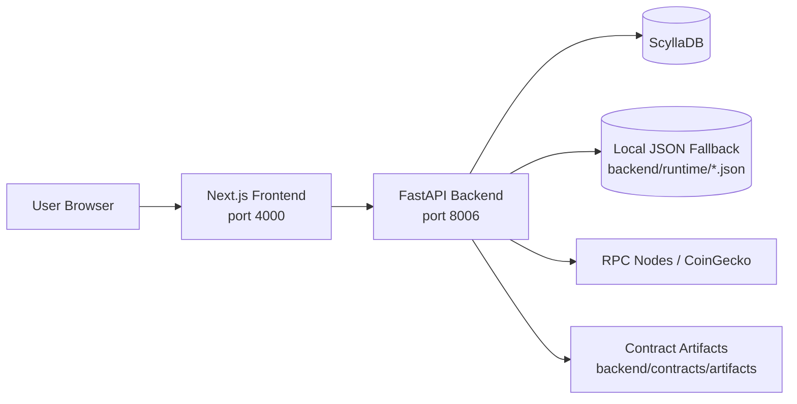
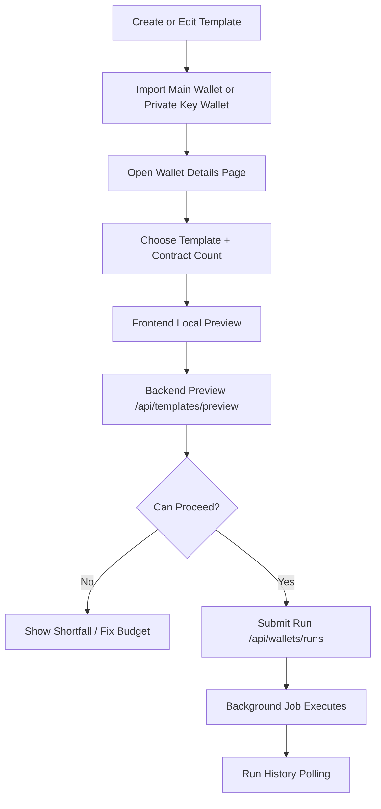
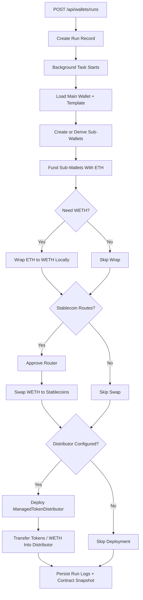

# Treasury V2

Project structure and execution flow for the current repository.

## What This Repo Does

This project is a wallet automation dashboard with three main parts:

- `frontend`: Next.js dashboard for wallet import, template management, preview, and run monitoring
- `backend`: FastAPI API for wallet storage, template validation, preview calculation, automation runs, and chain status
- `backend/contracts`: Solidity sources plus compiled artifacts used to map imported contract data and ManagedTokenDistributor deployment metadata

The core business model is:

- one template = one contract = one sub-wallet
- one run = main wallet + template + contract count

## Runtime Architecture



## Repository Structure

```text
.
|-- docker-compose.yml
|-- README.md
|-- backend
|   |-- main.py
|   |-- requirements.txt
|   |-- .env.example
|   |-- README.md
|   |-- data
|   |   |-- wallet_store.json
|   |   `-- template_store.json
|   |-- src
|   |   |-- config
|   |   |   `-- database.py
|   |   |-- routers
|   |   |   |-- template_router.py
|   |   |   `-- wallet_router.py
|   |   `-- services
|   |       |-- contract_service.py
|   |       |-- market_service.py
|   |       |-- solidity_service.py
|   |       |-- template_service.py
|   |       `-- wallet_service.py
|   `-- contracts
|       |-- src
|       |   |-- MainWalletRegistry.sol
|       |   |-- ManagedTokenDistributor.sol
|       |   |-- SubWalletRegistry.sol
|       |   `-- TokenConfigRegistry.sol
|       `-- artifacts
`-- frontend
    |-- app
    |   |-- layout.tsx
    |   |-- page.tsx
    |   `-- wallets/[walletId]/page.tsx
    |-- components
    |   |-- dashboard
    |   |   |-- recent-deals.tsx
    |   |   |-- template-editor.tsx
    |   |   |-- template-library-starter.tsx
    |   |   |-- template-market-check.tsx
    |   |   |-- wallet-details-page.tsx
    |   |   `-- wallet-run-history.tsx
    |   `-- ui
    |-- hooks
    |-- lib
    |   |-- api.ts
    |   `-- template.ts
    `-- public
```

## Backend Responsibility Map

### `backend/main.py`

- boots FastAPI
- enables CORS
- exposes `/health` and `/status`
- mounts wallet and template routers

### `backend/src/routers/wallet_router.py`

API surface for:

- importing main wallets by seed phrase
- importing wallets by private key
- listing and deleting wallets
- loading wallet details and sub-wallets
- exporting keystores
- creating automation runs
- polling run history
- quoting swaps

### `backend/src/routers/template_router.py`

API surface for:

- listing template options
- CRUD for templates
- live market check
- template preview against a wallet and contract count

### `backend/src/services/wallet_service.py`

Main execution engine. It handles:

- wallet generation/import
- encrypted storage material
- ETH/WETH balance reads
- sub-wallet derivation
- Uniswap quote logic
- run execution steps
- run logs, tx tracking, and deployment metadata

### `backend/src/services/template_service.py`

Main template domain logic. It handles:

- template validation
- stablecoin distribution rules
- per-contract and total funding calculations
- wallet support preview
- market snapshot enrichment
- contract registry sync preview

### `backend/src/config/database.py`

Persistence layer with two modes:

- ScyllaDB if available
- local JSON store fallback if Scylla is unavailable

Primary persisted entities:

- wallets
- templates
- wallet runs

## Frontend Responsibility Map

### Dashboard entry

- `frontend/app/page.tsx`
- renders the sidebar and top-level dashboard sections

### Wallet vault

- `frontend/components/dashboard/recent-deals.tsx`
- imports wallets
- lists saved wallets
- opens wallet detail pages
- embeds run history

### Template library

- `frontend/components/dashboard/template-library-starter.tsx`
- lists templates
- opens template editor
- triggers live market check

### Wallet detail workflow

- `frontend/components/dashboard/wallet-details-page.tsx`
- loads wallet details, templates, and template options
- computes a local preview
- requests authoritative backend preview
- submits the run
- displays automation steps, gas estimates, and history

### Run monitoring

- `frontend/components/dashboard/wallet-run-history.tsx`
- polls `/api/wallets/runs`
- shows funding, wrap, approval, swap, deploy, and export states

### Chain monitoring

- `frontend/components/dashboard/sections/pipeline.tsx`
- polls `/status`
- displays multi-chain node health

## Main User Flow



## Automation Run Flow



## API Flow Summary

### Wallet APIs

- `POST /api/wallets/main/import`: import seed phrase wallet
- `POST /api/wallets/private-key/import`: import private key wallet
- `GET /api/wallets`: list wallets
- `GET /api/wallets/{wallet_id}/details`: wallet + sub-wallet detail view
- `DELETE /api/wallets/{wallet_id}`: delete wallet
- `POST /api/wallets/runs`: create automation run
- `GET /api/wallets/runs`: list run history
- `POST /api/wallets/{wallet_id}/keystore`: export encrypted keystore

### Template APIs

- `GET /api/templates/options`: get stablecoin, fee-tier, and hint metadata
- `GET /api/templates`: list templates
- `POST /api/templates`: create template
- `PUT /api/templates/{template_id}`: update template
- `DELETE /api/templates/{template_id}`: soft delete template
- `GET /api/templates/{template_id}/market-check`: live market data
- `POST /api/templates/preview`: authoritative preview for wallet support and run plan

### System APIs

- `GET /health`: backend health
- `GET /status`: multi-chain node status dashboard

## Data Flow Details

### Template flow

1. Frontend loads template options from `/api/templates/options`.
2. User creates or edits a template in `template-editor.tsx`.
3. Backend validates addresses, fee tier, slippage, and stablecoin allocation rules.
4. Template is stored in Scylla or local JSON fallback.

### Wallet flow

1. User imports a main wallet by seed phrase or a wallet by private key.
2. Backend derives the wallet address, fetches balances, encrypts sensitive material, and stores only protected values.
3. Wallet list is refreshed in the frontend.
4. User opens `/wallets/[walletId]` for planning and execution.

### Preview flow

1. Frontend computes an immediate local estimate with `buildTemplateWalletSupportPreview`.
2. User clicks proceed.
3. Backend recomputes the authoritative preview with current balances, route logic, and contract sync data.
4. Frontend opens the review modal if the wallet can support the requested contract count.

### Execution flow

1. Frontend submits `main_id`, `template_id`, and `count`.
2. Backend creates a run record and schedules a background task.
3. Execution updates the run with funding, wrap, approval, swap, and deployment events.
4. Frontend polls run history and renders live progress.

## Local Development Flow

Start the full stack with Docker Compose:

```bash
docker compose up --build
```

Default local endpoints:

- frontend: `http://localhost:4000`
- backend: `http://localhost:8006`
- backend docs: `http://localhost:8006/docs`

## Important Notes

- The backend is designed to keep working even when Scylla is unavailable by falling back to `backend/runtime/*.json`.
- Solidity artifacts are used as imported metadata sources for registry mapping and distributor deployment context.
- The dashboard currently centers on Ethereum-mainnet-style ETH/WETH funding and stablecoin distribution flows.
